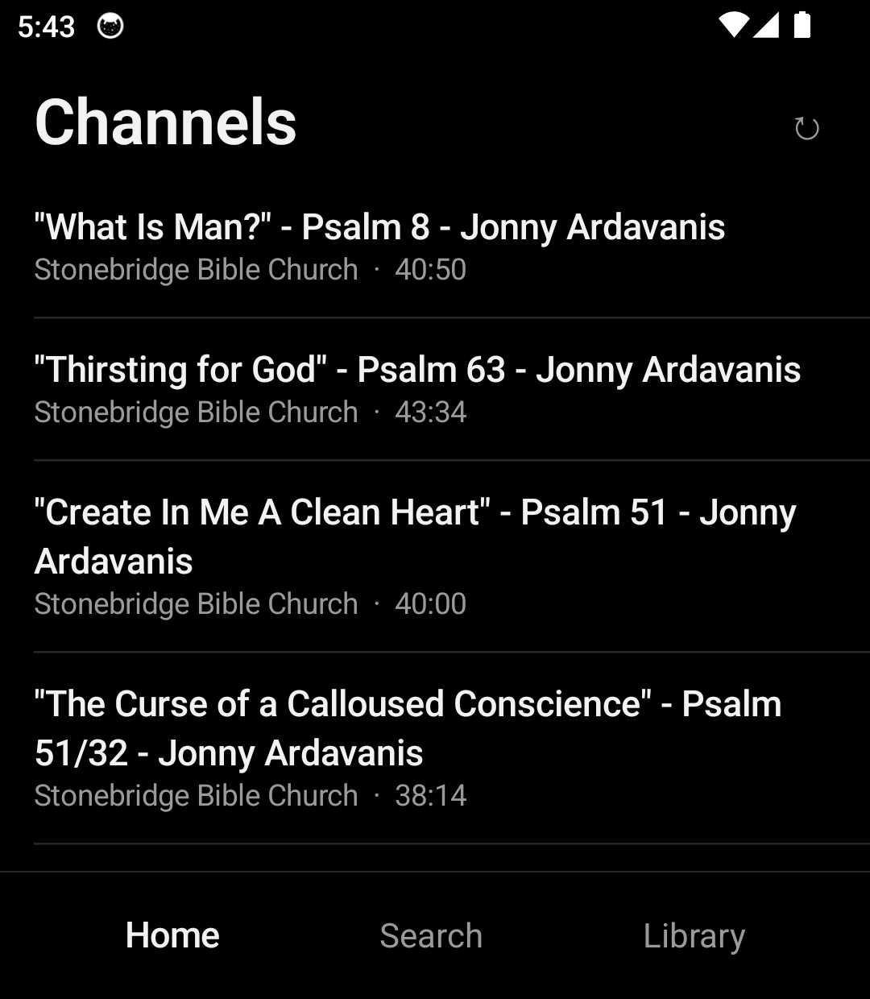
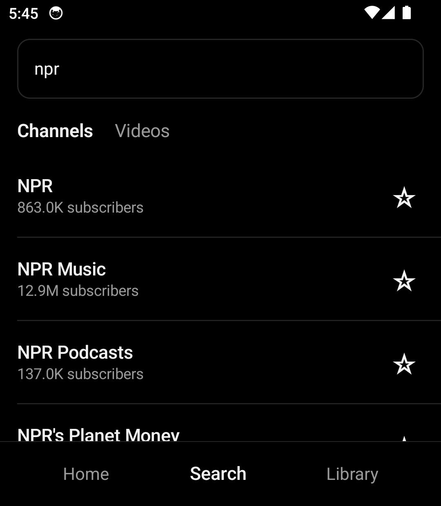
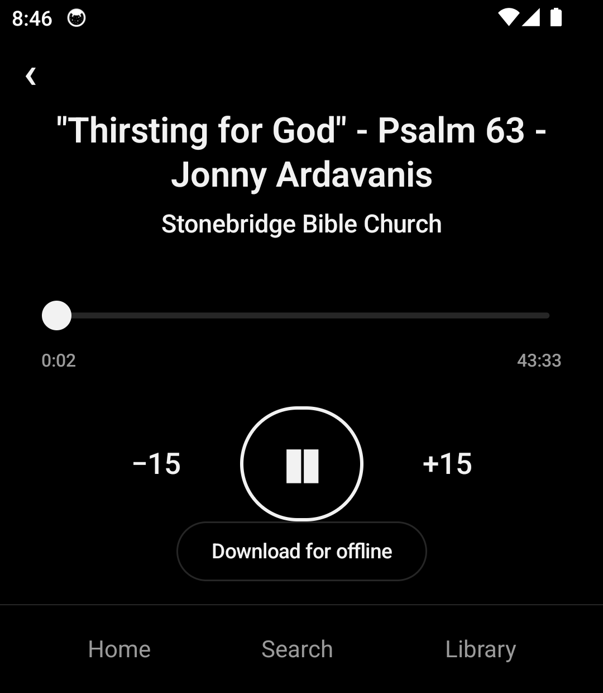
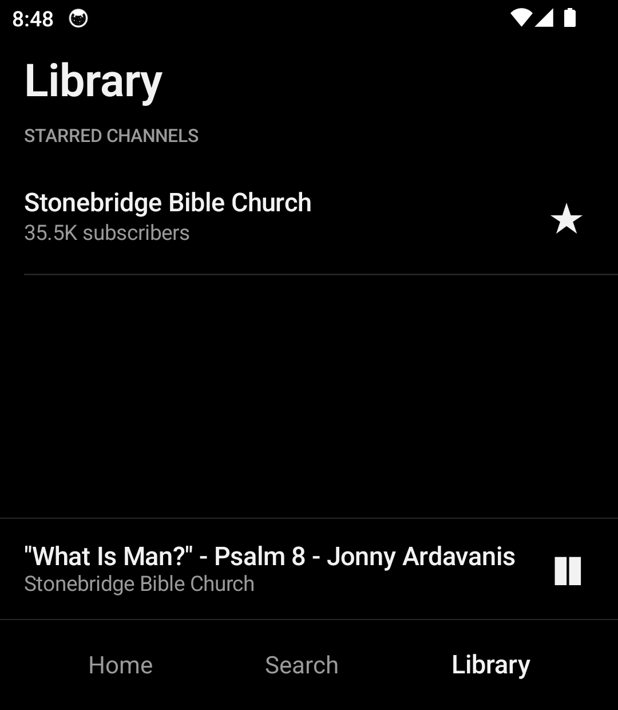

# Channels

**A podcast-style YouTube _audio_ player, styled after the Light Phone III.**
Search any channel, star your favorites, and listen to long-form videos as pure audio —
monochrome, ad-free, no account, no Shorts.

<p align="center">
  
  
  
  
</p>

## What it does

- 🔎 **Search** channels and videos.
- ⭐ **Star channels** — their newest long-form uploads collect on a **Home feed** that
  refreshes in the background.
- 🚫 **No Shorts** — a single rule filters them out everywhere.
- 🎧 **Background audio** — keeps playing with the screen off, with lock-screen /
  notification controls, variable speed, and ±15s skip.
- ⏭️ **Auto-advance** — when a show ends, the next one in the list plays automatically.
- 🌐 **Original language** — when a video ships dubbed audio tracks, it picks the original.
- ⬇️ **Offline downloads** — save a show's audio (fast, chunked) and play it with no signal.
- 🈚 **Ad-free** — it streams the bare audio, so there's no ad layer.

## Why

The Light Phone III is about doing less, better. There's no good way to just *listen* to a
YouTube channel on it without the video, the ads, the algorithm, and the Shorts. Channels is
that one small thing: a black-and-white, text-first audio player that turns the channels you
choose into a quiet listening feed.

## How it works (no account, no API key)

Channels never uses YouTube's official API. It reads YouTube's **public** pages the way a
browser does, via [NewPipeExtractor](https://github.com/TeamNewPipe/NewPipeExtractor), and
plays the video's underlying audio stream directly. That's why there's no login, no quota, and
no ads.

> ⚠️ This relies on YouTube's public site and sits in a **grey area** of YouTube's Terms of
> Service. It's built for personal use on your own device, not for distribution. The extractor
> can break when YouTube changes its site (it's actively maintained), and stream links are
> temporary — which is part of why offline downloads are handy.

## Tech

Kotlin · Jetpack Compose · MVVM · Coroutines/Flow · **Media3** (ExoPlayer + MediaSession) ·
**Room** · **WorkManager** · **NewPipeExtractor** · OkHttp.
`minSdk`/`compileSdk` **34**, sized for the Light Phone III display (**1080 × 1240**).

The non-UI layers are decoupled from Compose so the core could later be lifted into a real
Light Phone SDK "Tool":

```
com.channels
├─ data        # NewPipe repo, Room db, downloads, feed + refresh worker
├─ domain      # plain models + the single Shorts rule
├─ playback    # Media3 service + player controller (queue, auto-advance)
├─ ui          # Compose screens (home, search, channel, player, library) + theme
└─ di          # AppContainer (manual DI — no framework)
```

## Build & run

Requires the Android SDK and a **JDK 17–21** (the one bundled with Android Studio works well).

- **Android Studio:** open the project and Run.
- **Command line:** `./gradlew assembleDebug` — make sure `JAVA_HOME` points at a JDK 17–21
  (or set `org.gradle.java.home` in your user-level `~/.gradle/gradle.properties`).

Install on a device or emulator:

```bash
adb install -r app/build/outputs/apk/debug/app-debug.apk
```

## Tests

```bash
./gradlew testDebugUnitTest
```

The Shorts rule has unit tests. A network-gated smoke test exercises the live data path
(search → Shorts filtering → audio resolution); enable it with `-Dchannels.live=1`.

## Status

Working and runtime-verified on a Light Phone III–spec emulator. Possible next steps: a
settings screen (Shorts cutoff, default speed, Wi-Fi-only downloads) and closer typography
matching to the Light design system.

## Disclaimer

Personal project, provided as-is. Not affiliated with Light or YouTube. Respect the content
creators you listen to and YouTube's Terms of Service. No license is granted for
redistribution.
